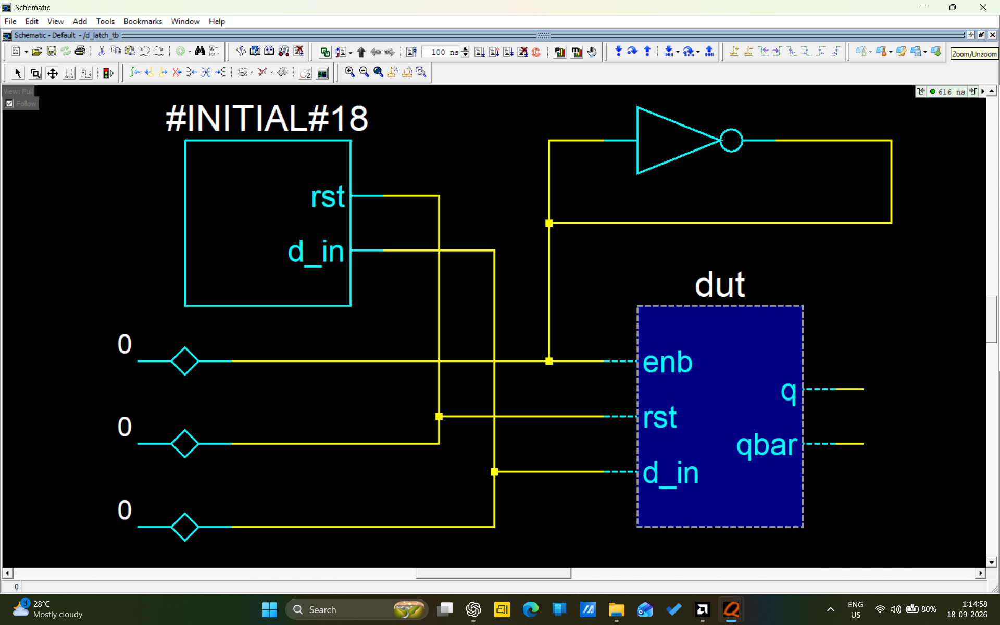
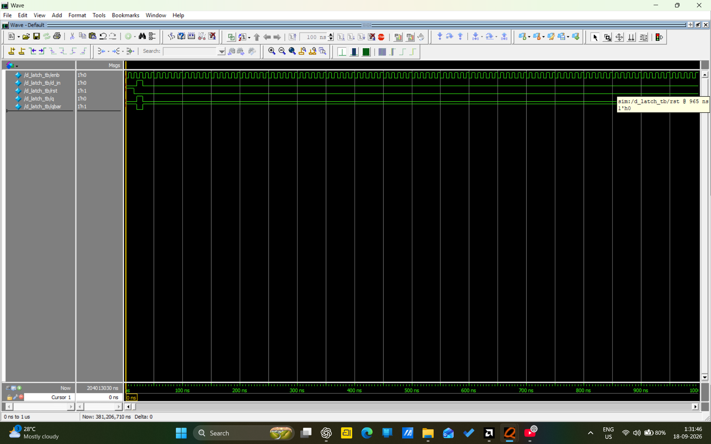
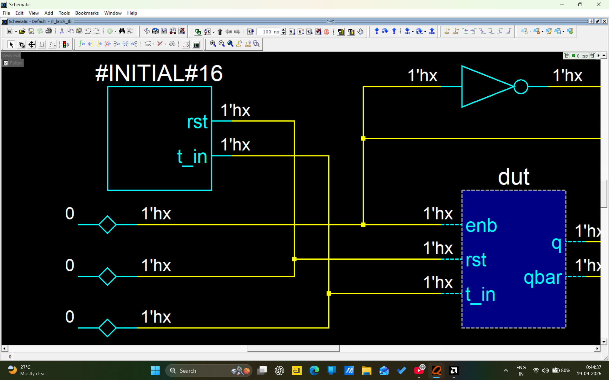
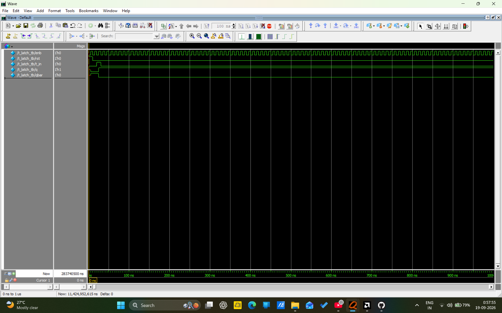
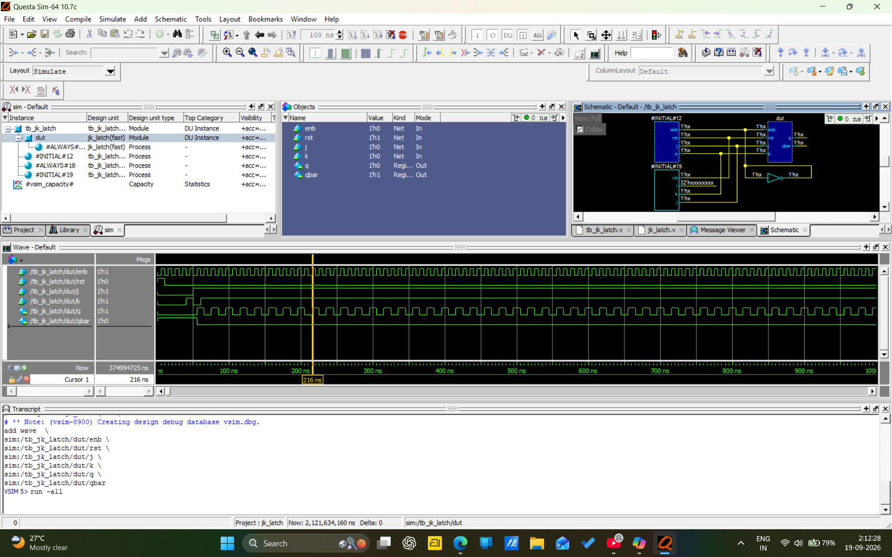
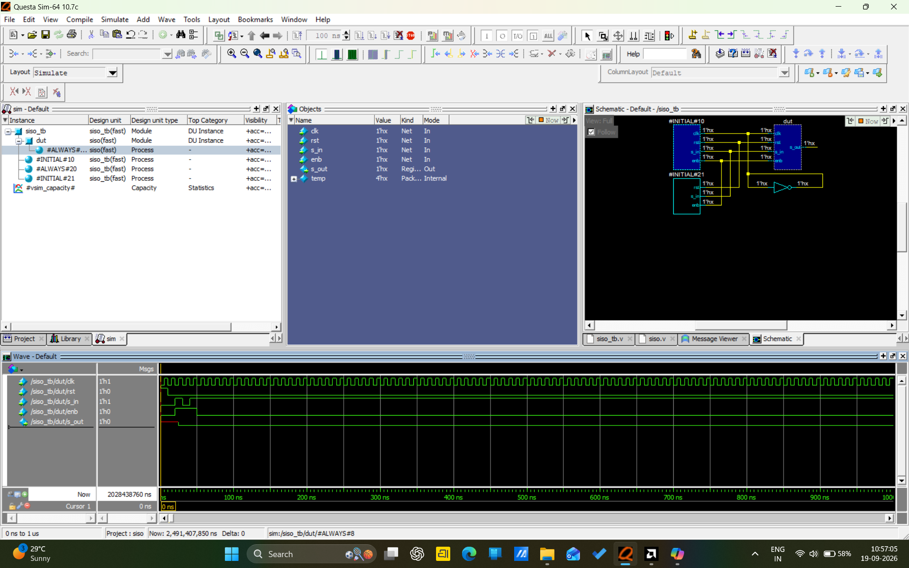

# Verilog Digital Design & Verification Using Siemens QuestaSim

This repository contains my collection of **digital electronics and RTL designs implemented using Verilog HDL and verified through Siemens QuestaSim**.

Each project includes the **Verilog design code, testbench, simulation results, and waveform screenshots** generated using QuestaSim. The repository documents my hands-on practice with digital logic design, RTL coding, functional verification, and simulation.

### Contents

* Digital logic circuits and fundamental digital designs
* Verilog HDL source codes
* Verilog testbenches
* Siemens QuestaSim simulations
* Simulation waveforms and screenshots
* Functional verification results

### Tools & Technologies

* Verilog HDL
* Siemens QuestaSim
* RTL Design
* Digital Electronics
* Functional Verification
* Waveform Analysis

### Objective

The main objective of this repository is to demonstrate my practical knowledge of **Verilog-based RTL design and functional verification** while building a strong foundation for a career in **VLSI Design Verification**.

### NOTE* These codes debugged and verified through Seimens EDA tool (QuestaSim) Advance verification.The verification screenshots are in this repository.

### Results

### d_latch

----------------------------------------------------------------------------
### t_latch

-----------------------------------------------------------------------------
### jk_latch

### siso register 

